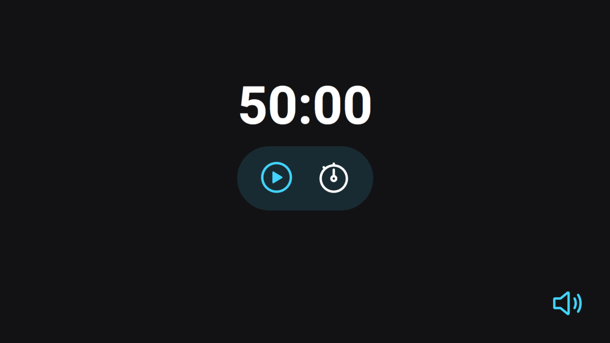

# Rocketseat Explorer - Stage 05 Projeto Assistido

Projeto de um temporizador pomodoro.

A elboração deste projeto teve foco em aprimorar os conceitos:
- ES6 Modules;
- Modulação;
- Refatoração;
- Padrão Factory de importação/exportação de elementos.

Alterei e adicionei novas lógicas e funcionalidades ao projeto, que não foram passadas em aula:
- Adicionado timer de descanso;
- Adionado mudança de cor no timer;
- Alterado o funcionamento da música de fundo;
- Alterado o funcionamento do botão de controle do som.

[Clique aqui para acessar](https://buucocs.github.io/expl-stg5-mdl3/)

## Tecnologias

- HTML
- CSS
- javaScript
- Git e Github

## Contato

- contato@leonardohgomes.com.br
- @leonardohgomes_
- https://github.com/Buucocs